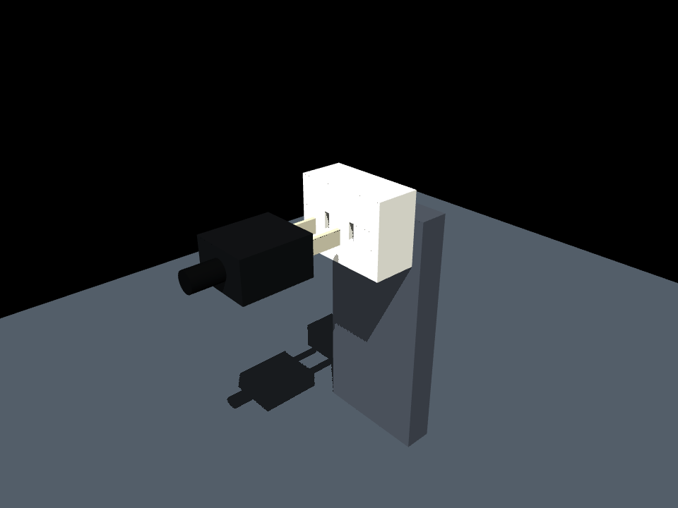

# Two-blade connector simulation

**Continuous table -> grasp -> insert now works** in a separately versioned,
90-degree-rotated socket fixture. Six physical validation runs pass; nominal
command replay is exact. See [full-task results and video](docs/FULL_TASK_DEMONSTRATOR.md).

Final task development now targets **table -> grasp -> insert**. See the
[layout, camera previews and physical pickup findings](docs/TABLE_TO_INSERT.md).
Downward-rest pickup passes eight physical tests; transport/insertion is now
validated in the full-task variant above. The held-plug insertion benchmark below
remains unchanged and is viewed with `--task insertion`.

New: [ten varied demonstrations and camera review](docs/DATA_COLLECTION.md), with
reserved evaluation resets. SmolVLA is now the first training target; training has
not started and contact visibility needs attention before scaling collection.

The next milestone is now implemented: **OpenArm v1 bimanual, right-arm physical
insertion, and 20 replayable pilot episodes**. Start with
[the OpenArm pipeline guide](docs/OPENARM_PIPELINE.md) and
[the sim-to-real contract](docs/SIM2REAL_CONTRACT.md).

The next local VLA integration is available in [the pi0 adapter guide](docs/VLA_ADAPTER.md):
pinned upstream source, explicit OpenArm mappings, full-window training samples,
and a float32 replay audit. Training has not started; the strict velocity replay
comparison remains flagged and a suitable Linux GPU host is still needed.

```powershell
python scripts/view_openarm.py
```

This now opens the downward-rest table task. Add `--play` for pickup, or
`--task insertion` for the original held-plug benchmark (Space/R controls).

The remainder of this page documents the preserved standalone straight-slot
baseline. Its commands and results remain available for regression comparisons.

A simplified, unpowered two-flat-blade plug with a graspable housing, two separate
socket slots, and a force-driven compliant holder. This is the first reusable
foundation for the robot and fine-tuning stages in [plan.md](plan.md).



## Run

Tested with Python 3.11 and official MuJoCo 3.11.0. Install dependencies if needed:

```powershell
python -m pip install -r requirements.txt
python scripts/view_connector.py
```

Viewer controls: Space advances/pauses the holder target; R resets. Y/G changes
lateral offset by +/-0.25 mm, Z/X vertical offset, A/D yaw by +/-1 degree, W/S
pitch, and E/Q roll. Changes reset the trial. C enables transparency to inspect
internal blade contacts. Diagnostics appear in the launching terminal. Terminal
outcomes freeze the scene until reset. Paused time does not use the trial timeout.

Automated tests:

```powershell
python scripts/test_insert.py
python scripts/test_insert.py --offset-z-mm 1 --output results/two_blade_v1_straight/z1
python scripts/sweep_alignment.py
python -m unittest discover -s tests -v
python scripts/validate_connector.py
python scripts/render_connector.py --animate
```

The single-trial command exits 0 on success and 1 on failure (including an expected
jam). It writes summary.json, metadata.json, and trace.csv. Choose a new
`--output` directory to preserve an earlier run; rerunning an output path replaces
its generated results. The sweep records all outcomes without treating a jam as a
script error.

The default sweep varies each of Y, Z, roll, pitch, and yaw independently over
signed values. Use `--mode grid` for combinations, with small explicit ranges;
the full default grid is large. Negative comma-separated lists should use equals:

```powershell
python scripts/sweep_alignment.py --mode grid --offset-y-mm=-0.25,0,0.25 --offset-z-mm=0 --roll-deg=0 --pitch-deg=0 --yaw-deg=-1,0,1 --output results/two_blade_v1_straight/combined
```

## What is validated

The baseline has straight slots, without lead-ins. Saved evidence:

- [Validation report](results/two_blade_v1_straight/validation.json): 20 identical
  aligned successes; six representative outcomes agree at half timestep.
- [41-case signed sweep](results/two_blade_v1_straight/sweep/alignment_sweep.csv):
  nominal and +/-0.25 mm lateral/vertical offsets succeed; +/-0.5 mm and larger
  sampled offsets jam. +/-1 degree succeeds on all angular axes; further
  behavior depends on the axis and holder compliance.
- [Aligned animation](results/two_blade_v1_straight/preview/insertion.gif) and
  [1 mm lateral jam](results/two_blade_v1_straight/preview_jam/insertion.gif).
- Eleven regression tests cover false success, initial overlap rejection,
  socket-frame invariance, force filtering, hold duration, paused time,
  repeatability, and timestep sensitivity.

Aligned seating reaches approximately 16 mm per blade. Peak contact force is
about 0.316 N; peak penetration is about 0.0036 mm. These are simulation outcomes
under the configured holder, not measurements of a real electrical connector.

## Reusable geometry and frames

`assets/connector/plug_socket.xml` composes an elevated fixture and the reusable
`plug.xml` / `socket.xml` body includes. The socket frame is at the midpoint
between slot entrances. +X is insertion, Y separates the blades, and Z is the
blades' broad dimension. Roll/pitch/yaw are X/Y/Z rotations, applied as
Rz(yaw) @ Ry(pitch) @ Rx(roll). Angles in CLI inputs are degrees; internal physical
quantities are SI.

| Site | Purpose |
| --- | --- |
| plug_mating_frame | Housing front center; origin for relative plug pose |
| plug_grasp_frame | Proposed grasp at X=-16 mm behind the housing front |
| plug_tip_left / plug_tip_right | Each blade tip |
| socket_entry | Socket coordinate origin |
| slot_left_entry / slot_right_entry | Distinct slot centers |
| socket_seated_frame | Desired mating frame when housing seats |
| socket_preinsert_frame | Initial approach frame, 22 mm before socket |

The 28 x 24 x 16 mm housing is rigidly connected to two 16 x 1.5 x 6 mm blades.
Slot spacing is 13 mm; each slot is 2.3 x 6.8 mm. Both blades are equal, so a
180-degree roll is an allowed mating pose with swapped slots. Proposed grasp
faces lie at Y=+/-12 mm; actual finger dimensions and reach still need checking
against the selected robot. The rear strain relief is visual only.

## Holder and success contract

`connector/simulation.py` supplies shared simulation, diagnostics, and trial
logic used by the test, sweep, viewer, and renderer. Controller parameters and
thresholds live in [configs/holder.json](configs/holder.json).

A 10 mm/s target moves along the socket X axis. A bounded spring-damper wrench
acts at the grasp frame; ideal gravity compensation acts at COM separately.
The target keeps its original Y/Z and orientation errors. Contact may deflect
the body, but no controller silently corrects the command to perfect alignment.
The dynamic plug pose is written only during reset.

The force application uses MuJoCo's
[mj_applyFT point-wrench API](https://mujoco.readthedocs.io/en/3.4.0/APIreference/APIfunctions.html#mj-applyft)
to include the grasp-to-COM moment arm.

Success requires both tips >=15 mm deep, every blade corner within its assigned
straight slot corridor (50 micrometre fit tolerance), face gap from -0.2 to +1 mm,
full relative orientation <3 degrees from an allowed mating pose, acceptable
contact/penetration, and 0.25 s continuously valid. The whole hold can begin
within the 1 mm face-gap tolerance; it does not imply 0.25 s of housing contact.

Contact force is the sum of plug/socket contact-force magnitudes, not a net
wrench. Per-blade forces and non-socket contact forces are separate. Trace
velocities are world-frame grasp velocities; relative quaternion is socket-frame
wxyz. Commanded pose is in metadata; actual first-contact pose is in the summary.

Outcomes include success, jam, timeout, initial_state_rejection,
force_limit_abort, penetration_abort, prohibited_contact, and numerical_failure.
Jam requires sustained contact and less than 0.1 mm depth variation for 0.4 s
while advancement is commanded. Solver warnings and large velocity excursions
abort the trial; finite numbers alone do not certify physical validity.

Each trial saves scene/configuration identity, XML hashes, MuJoCo version, and
seed metadata. These trials are deterministic and use no randomization.

## Next step

Add lead-ins as one isolated geometry change and compare against this saved
straight-slot sweep. The current corridor checker intentionally assumes straight
slots; update and test it if the final seating corridor changes.

Then verify actual OpenArm finger clearance and controller compatibility.
Compose the same connector bodies in a robot scene, replace the ideal holder with
robot actuation, and retain the site/metric contract. Real grasp compliance,
slip, cable load, calibrated resistance, and learned policies are not yet modeled.
The passive GUI has not been manually exercised in this run; offscreen rendering
and headless physics have been executed.

The first foundation milestone is complete; full Gate 3 in plan.md (including
lead-in comparison and broader boundary validation) is not claimed complete.
Robot data collection and fine-tuning remain later gated work.

Physics decisions are recorded in [PHYSICS_CHANGELOG.md](PHYSICS_CHANGELOG.md).
The original executable box scene, scripts, and results are preserved in
[baselines/box_v0](baselines/box_v0). The old root
`results/alignment_sweep.csv` also remains unchanged and describes that old scene.
