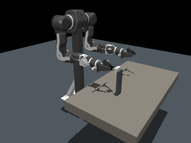
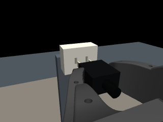

# OpenArm v1 pilot pipeline

This milestone provides a working bimanual scene, one-arm insertion, and replayable
pilot demonstrations. It does not yet train a VLA or implement RLT.




## Run the robot scene

From the workspace root:

```powershell
python scripts/view_openarm.py --task insertion
python scripts/test_openarm.py
python scripts/test_openarm.py --offset-y-mm 1
python scripts/render_openarm.py
python scripts/validate_openarm.py
```

Space runs/pauses the viewer and R resets. The passive GUI is provided but has not
been manually exercised in this run. Offscreen camera rendering and physics were
executed. [Insertion preview](../results/openarm_v1/preview/insertion.gif) and
[forced-jam recovery](../results/openarm_v1/recovery_preview/insertion.gif) are saved.

The official assets are downloaded under third_party/openarm_mujoco, pinned to
the source revision in envs/scene.py. On a fresh workspace use
`powershell -File scripts/fetch_openarm.ps1`; it refuses to replace existing assets.
The external asset checkout and raw data are excluded by .gitignore. Keep the
upstream license when redistributing assets.

Robot source: [official OpenArm MuJoCo repository](https://github.com/enactic/openarm_mujoco).
The selected asset is v1/openarm_bimanual.xml, not the v2 model.

## Pilot data

Twenty episodes live under data/openarm_v1_pilot. All use a physical grasp and
the same privileged expert, with initial Y/Z offsets sampled within +/-0.3 mm.
This deliberately small distribution tests the pipeline; it does not test broad
generalization or sim-to-real performance. Pickup and cable handling are absent.

```powershell
python scripts/collect_pilot.py --output data/another_pilot
python scripts/replay_pilot.py --dataset data/openarm_v1_pilot
python scripts/prepare_vla_data.py --dataset data/openarm_v1_pilot
```

Collection refuses to overwrite an existing dataset. Replay runs the recorded
requested commands, compares actual applied targets and every qpos/qvel sample,
and verifies termination timing without calling the expert. A changed scene,
controller, code bundle or MuJoCo version invalidates strict replay.

Each episode has:

- episode.npz: T actions, T+1 observations, fixed/wrist RGB, timestamps, executed
  durations, reward/termination flags, phases, and simulator states for audit.
- metadata.json: source/configuration hashes, action/state conventions, camera
  parameters, reset options, source labels, instruction, and data checksum.
- diagnostics.json: privileged contact/alignment/grasp metrics, separate from
  actor inputs.

The 80/20 split uses whole episodes (16 training, four validation). Normalization
is fitted to training episodes only; masks exclude padded commands at episode
boundaries. No test-set statistics or simulator poses enter policy observations.

```python
from data_pipeline.vla_dataset import PilotVLADataset
from controllers.chunks import execute_chunk

dataset = PilotVLADataset("data/openarm_v1_pilot", split="train", horizon=10)
sample = dataset[0]  # RGB, normalized state, instruction, actions, action_mask
physical_actions = dataset.denormalize_action(sample["actions"])
# A policy's denormalized predictions use this same executor:
# transitions = execute_chunk(env, physical_actions, prefix=4)
```

The adapter is NumPy-only and intended for pilot verification. NPZ storage is
lossless but not optimized for large shuffled image training; convert to a pinned
LeRobot schema/video storage after choosing the VLA checkpoint and backend.
Do not infer an installed openpi training stack from this adapter.

The source label is privileged_scripted_expert: alignment uses exact simulation
geometry. This is acceptable demonstrator assistance; learning only receives RGB,
joint state, and instruction. The pilot contains successful alignment/insertion;
the deliberately incorrect recovery probe is excluded from BC data.

## Acceptance evidence

- results/lead_in_comparison/report.json: 49 matched cases, repetitions and
  half-timestep checks; lead-ins improve capture while retaining a failure region.
- results/openarm_v1/validation.json: 20 repeated aligned successes, eight signed
  offset corrections, forced-jam recovery, half-timestep agreement, grasp drift,
  force/penetration and parked-arm stability.
- data/openarm_v1_pilot/replay_report.json: command replay against every pilot
  state and outcome.
- data/openarm_v1_pilot/training_readiness.json: schema/split, normalization,
  round-trip and chunk-mask checks.

Signed robot tests use active expert correction; they are not passive difficulty
curves and should not be compared directly with the holder's fixed-error tests.

## Before scaling to training

1. Audit this action/state schema against the intended OpenArm v1 hardware
   controller and the chosen flow-based VLA checkpoint.
2. Pin a Linux/GPU openpi setup and verify internal feature access for later RLT.
3. Add a checkpoint-specific data adapter and run a tiny supervised overfit test.
4. Add measured camera/pose variation, genuine recovery demonstrations, and a
   separate held-out benchmark before a larger training run.
5. Evaluate closed-loop VLA rollouts before preparing the learned RL token.

See [SIM2REAL_CONTRACT.md](SIM2REAL_CONTRACT.md) for all uncalibrated assumptions
and [plan.md](../plan.md) for the staged learning roadmap.
